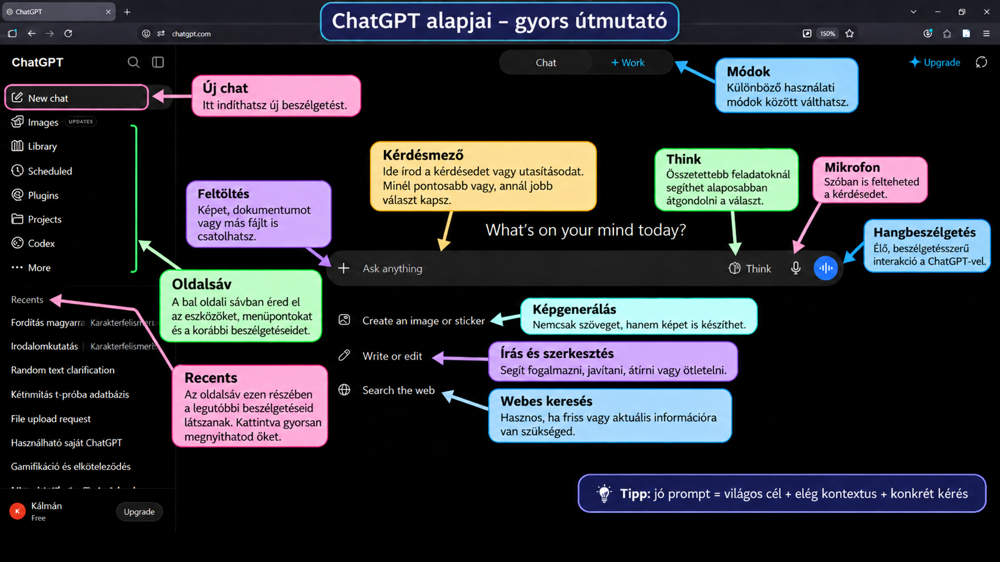

# A Free verzió felépítése

*Frissítve: 2026. szeptember 10.*

## Mit nyújthat a ChatGPT egy pszichológusnak?

A ChatGPT egy általános célú MI-asszisztens, amely szöveggel, képekkel, fájlokkal és – a csomagtól függően – webes információkkal is tud dolgozni. Pszichológushallgatóként és később szakemberként elsősorban **gondolkodási, tanulási és munkaszervezési segédeszközként** érdemes rá tekinteni.

Használható például fogalmak és elméletek elmagyarázására, vizsgafelkészülésre, szakirodalmi tájékozódásra, kutatási kérdések finomítására, kérdőív- vagy interjúötletek megvitatására, szövegek javítására, adatok értelmezésének támogatására, prezentációk és ábrák tervezésére, illetve gyakorló helyzetek vagy szerepjátékok létrehozására.

A ChatGPT ugyanakkor **nem tekintélyforrás és nem hibamentes**. Pszichológiai és tudományos használatnál különösen fontos a válaszok ellenőrzése, a források visszakeresése, valamint az adatvédelem: kliens-, páciens- vagy kutatási résztvevőhöz köthető érzékeny személyes adatot csak az adott intézmény és szolgáltatás adatkezelési szabályainak megfelelően szabad MI-rendszerbe bevinni.

## ChatGPT-előfizetések röviden

Az elérhető funkciók és használati korlátok idővel változhatnak. Az alábbi összefoglaló a 2026. szeptember 10-i állapotot tükrözi; a tényleges ár országonként, adózástól és számlázástól függően eltérhet.

| Csomag | Kinek lehet elég? | Fő különbség |
|---|---|---|
| **Free** | alkalmi használat, tanulás, kipróbálás | GPT-5.6 Luna; webes keresés, fájlfeltöltés, képgenerálás, adatelemzés és hang elérhető, de több funkció korlátozott kerettel |
| **Go** | rendszeres hallgatói használat kedvezőbb áron | a Free-nél magasabb használati korlátok, több feltöltés és képgenerálás, hosszabb memória és kontextus; továbbra is GPT-5.6 Luna |
| **Plus** | intenzív tanulás, kutatás, hosszabb feladatok | havi **20 USD**; hozzáférés a GPT-5.6 Sol fejlettebb gondolkodási módjaihoz, nagyobb keretek, bővebb kutatási és Work-funkciók |
| **Pro 100** | erős napi használat, összetett kutatási és szakmai feladatok | havi **100 USD**; Pro-képességek és kb. 5× Plus-szintű használati keret |
| **Pro 200** | nagyon intenzív professzionális használat | havi **200 USD**; a legmagasabb személyes használati keretek, kb. 20× Plus-szint, több GPT-6 Pro és GPT-5.6 Sol Pro használat |
| **Business** | kutatócsoportok, szervezetek | közös, adminisztrálható és biztonságos munkatér; a szervezeti adatokon alapértelmezés szerint nincs modelltréning |
| **Enterprise / Edu** | nagy intézmények, egyetemek | intézményi biztonsági, jogosultsági, adminisztrációs és skálázási lehetőségek; egyedi szerződés és keretek |

### Mit érdemes választani hallgatóként?

Az **ingyenes csomag** már elegendő a ChatGPT alapjainak megtanulásához. A **Go** akkor lehet hasznos, ha sok fájlt töltesz fel vagy gyakran használsz képgenerálást és adatelemzést; a **Plus** pedig akkor indokolt, ha rendszeresen végzel hosszabb, összetettebb tanulási vagy kutatási feladatokat.

> **Fontos:** a drágább csomag nem teszi automatikusan "igazzá" a választ. A jobb modellek és magasabb korlátok mellett is szükség van kritikus ellenőrzésre.

# A képen látható ChatGPT-felület

## Új chat

Az **Új chat** gombbal teljesen új beszélgetést indíthatsz. Ez akkor hasznos, ha új témába kezdesz, és nem szeretnéd, hogy az előző beszélgetés kontextusa befolyásolja az új feladatot.

## Oldalsáv

A bal oldali **oldalsáv** a ChatGPT navigációs területe. Innen érhetők el a korábbi beszélgetések, projektek, képek, ütemezett feladatok és más eszközök – a pontos lista csomagtól és aktuális felülettől függhet.

## Recents

A **Recents** részben a legutóbbi beszélgetéseid jelennek meg. Egy címre kattintva visszatérhetsz a korábbi chathez, így nem kell minden alkalommal elölről kezdened ugyanazt a témát.

## Feltöltés (+)

A **+** gombbal képet, PDF-et, Word-dokumentumot, táblázatot vagy más támogatott fájlt csatolhatsz. A ChatGPT ezután a fájl tartalmára támaszkodva tud összefoglalni, magyarázni, összehasonlítani vagy adatokat elemezni.

## Kérdésmező

A **kérdésmezőbe** írjuk a promptot, vagyis azt a kérést vagy utasítást, amelyre választ várunk. A jó prompt általában tartalmazza a **célt**, a szükséges **kontextust**, és azt is, hogy **milyen formában** szeretnénk megkapni a választ.

## Think

A **Think** mód nehezebb kérdéseknél több belső feldolgozást enged a modellnek. Érdemes használni például összetettebb érvelésnél, kutatástervezésnél, módszertani összehasonlításnál vagy több feltételt tartalmazó feladatnál.

## Mikrofon

A **mikrofon** ikon segítségével begépelés helyett szóban is megadhatod a kérdésedet. Ez gyors jegyzetelésre, ötletelésre vagy hosszabb kérdések kényelmes bevitelére is használható.

## Hangbeszélgetés

A **hangbeszélgetés** mód folyamatos, beszélgetésszerű interakciót tesz lehetővé a ChatGPT-vel. Pszichológushallgatóknál különösen érdekes lehet például szóbeli vizsgára gyakorlás, idegen nyelvű szakmai kommunikáció vagy szimulált interjúhelyzetek során.

## Képgenerálás

A **Képgenerálás** funkcióval szöveges leírás alapján illusztrációt, sematikus ábrát, infografikát vagy más vizuális anyagot készíthetsz. Oktatási használatnál érdemes pontosan megadni a célközönséget, a kívánt stílust, a feliratokat és a kép arányát.

## Írás és szerkesztés

Az **Írás és szerkesztés** gyorsindító a szövegalkotással kapcsolatos feladatokhoz. Használható például egy bekezdés tömörítésére, nyelvi javításra, vázlatkészítésre vagy egy szakmai szöveg közérthetőbb megfogalmazására.

## Webes keresés

A **Webes keresés** akkor fontos, amikor friss vagy ellenőrizhető információra van szükséged. Tudományos munkában azonban a webes találatokat mindig külön is értékeld, és ahol lehet, keresd meg az eredeti tanulmányt vagy hivatalos forrást.

## Chat és Work mód

A **Chat** a hagyományos, beszélgetésközpontú használat: kérdezel, a ChatGPT pedig válaszol és együtt dolgozik veled. A **Work** összetettebb, több lépéses feladatokra szolgálhat, például több fájl feldolgozására, kutatásra, elemzésre vagy kész munkatermék előállítására; elérhetősége csomagtól függ.

# Egy egyszerű szabály jó promptokhoz

> **Jó prompt = világos cél + elegendő kontextus + konkrét kérés**

Példa:

**Gyengébb:**  
„Magyarázd el a klasszikus kondicionálást.”

**Jobb:**  
„Magyarázd el a klasszikus kondicionálást elsőéves pszichológia BA hallgatónak, 5–6 mondatban, Pavlov példájával, majd adj egy hétköznapi példát is.”

A második változatból a ChatGPT pontosabban tudja, **kinek**, **milyen mélységben**, **milyen terjedelemben** és **milyen formában** kell válaszolnia.

# Mit vigyünk magunkkal?

A ChatGPT legerősebb használati módja nem az, amikor „megkérdezzük a választ”, hanem amikor **gondolkodási partnerként** használjuk: kérdezünk, pontosítunk, kritikát kérünk, alternatívákat hasonlítunk össze és ellenőrizzük az eredményt.

Pszichológusként ezért három alapelv különösen fontos:

1. **Kérdezz pontosan.**
2. **Ellenőrizd a választ.**
3. **Használd felelősen az adatokat.**

