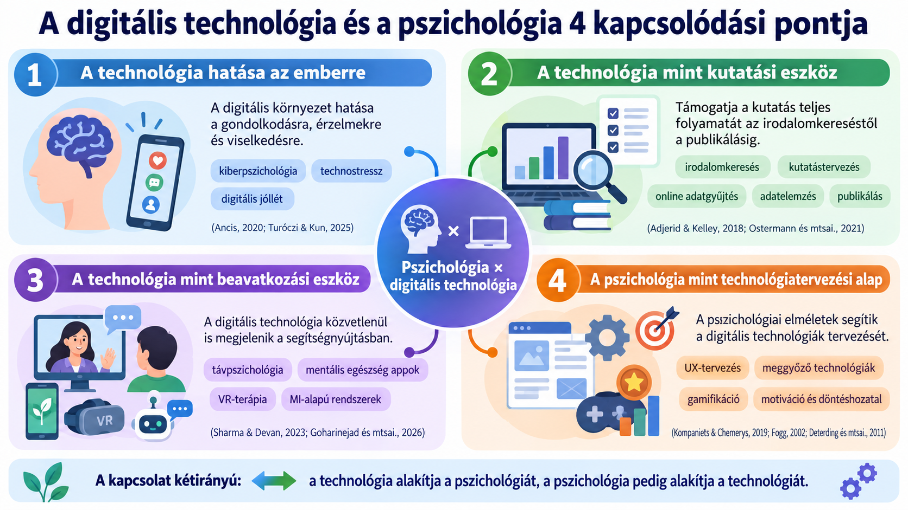

# A digitális technológia

## A digitális technológia és a pszichológia 4 kapcsolódási pontja

1. **A technológia hatása az emberre**  

   A pszichológia vizsgálja, hogyan alakítja a digitális környezet az emberi gondolkodást, érzelmeket és viselkedést. Ide tartozik például a **kiberpszichológia**, a **technostressz**, valamint a **digitális jóllét** kutatása [@Ancis2020; @TurocziKun2025].

2. **A technológia mint kutatási eszköz**  

   A digitális technológiák ma már a pszichológiai kutatás teljes folyamatát támogatják: az **irodalomkereséstől és kutatástervezéstől** az **online adatgyűjtésen és adatelemzésen** át egészen a **publikálásig és az eredmények megosztásáig** [@AdjeridKelley2018; @OstermannEtAl2021].

3. **A technológia mint beavatkozási eszköz**  

   A digitális technológia közvetlenül is megjelenhet a pszichológiai segítségnyújtásban. Ilyen például a **távpszichológia**, a **mentális egészséget támogató mobilalkalmazások**, a **virtuális valóságon alapuló terápiás megoldások**, valamint az **MI-alapú rendszerek** [@SharmaDevan2023; @GoharinejadEtAl2026].

4. **A pszichológia mint technológiatervezési alap**  

   A kapcsolat fordítva is működik: a pszichológiai elméletek és kutatási eredmények segítik a digitális technológiák tervezését. A fejlesztők például a **kognitív pszichológia**, a **motiváció**, a **tanulás** és a **döntéshozatal** eredményeire támaszkodnak a felhasználói élmény kialakításakor. Ennek klasszikus példái a **UX-tervezés**, a **meggyőző technológiák** és a **gamifikáció** [@KompanietsChemerys2019; @Fogg2002; @DeterdingEtAl2011].
   
   
   
   
## DigComp 3.0 – mit jelent a digitális kompetencia?

A **DigComp** (*Digital Competence Framework for Citizens*) az Európai Bizottság digitáliskompetencia-keretrendszere.

A **DigComp 3.0** 2025-ben jelent meg, és a digitális kompetenciát nem egyszerűen technikai tudásként értelmezi [@CosgroveCachia2025].

> **Digitális kompetencia = a digitális technológiák magabiztos, kritikus és felelősségteljes használata.**

Ehhez három dolog együttesen szükséges:

**tudás + készségek + attitűdök**

### Mi változott a DigComp 3.0-ban?

A DigComp 3.0 több olyan területet hangsúlyosabban kezel, amely a mai digitális környezetben különösen fontossá vált [@CosgroveCachia2025]:

- **mesterséges intelligencia és generatív MI**
- **kiberbiztonság**
- **adatvédelem és digitális jogok**
- **digitális jóllét**
- **félretájékoztatás és dezinformáció**
- **kritikus és etikus technológiahasználat**

A cél tehát nem pusztán az, hogy **tudjuk használni** a digitális eszközöket, hanem az is, hogy **értsük, értékeljük és felelősen használjuk** őket.

### Fontos: a DigComp technológiafüggetlen

A DigComp 3.0 szándékosan nem mondja meg, hogy milyen konkrét programot kell használni.

Nem azt írja elő, hogy:

- használj **ChatGPT-t**,
- elemezz **R-rel**,
- dolgozz **Google Drive-ban**,
- vagy készíts táblázatot **Excelben**.

Ehelyett azt fogalmazza meg, hogy **mire kell képesnek lennünk** a digitális környezetben [@CosgroveCachia2025].

> Így a keretrendszer akkor is használható marad, ha néhány év múlva már egészen más szoftvereket használunk.

### A DigComp 3.0 felépítése

A keretrendszer hierarchikusan épül fel [@CosgroveCachia2025]:

- **5 kompetenciaterület**
- **21 kompetencia**
- **4 jártassági szint**
- **362 kompetenciaállítás**
- **523 tanulási eredmény**

A rendszer az általános digitális kompetenciáktól halad az egyre konkrétabb, megfigyelhető tudás, készség és viselkedés felé.

### Az 5 digitális kompetenciaterület

- 1. Információkeresés, -értékelés és -kezelés  
Információk megtalálása, hitelességük értékelése, valamint adatok és fájlok rendszerezése.

- 2. Kommunikáció és együttműködés  
Digitális kommunikáció, megosztás, együttműködés, netikett és digitális identitás.

- 3. Digitális tartalomelőállítás  
Szöveg, kép és más digitális tartalom létrehozása, szerzői jogok kezelése és számítógépes gondolkodás.

- 4. Biztonság, jóllét és felelős használat  
Eszközök és személyes adatok védelme, valamint a digitális technológia jóllétre gyakorolt hatásának tudatos kezelése.

- 5. Problémaazonosítás és problémamegoldás  
Megfelelő digitális eszközök kiválasztása, technikai problémák kezelése és új digitális megoldások kialakítása [@CosgroveCachia2025].

### Négy jártassági szint

A DigComp nem egyszerűen azt kérdezi, hogy:

**„Tudod vagy nem tudod?”**

Hanem azt is, hogy **milyen önállóan és milyen komplex helyzetben** tudod alkalmazni a kompetenciát.

| Szint | Jellemző |
|---|---|
| **Alap** | egyszerű feladatok, gyakran segítséggel |
| **Középhaladó** | jól körülhatárolt feladatok önállóan |
| **Haladó** | komplex problémák önálló megoldása |
| **Kiváló** | új megoldások létrehozása, mások támogatása |

[@CosgroveCachia2025]

### Tudás, készség és attitűd

A digitális kompetencia háromféle tanulási eredményt foglal magában [@CosgroveCachia2025].

#### 🧠 Tudás

**Mit tudok és mit értek?**

Például:

- felismerem,
- azonosítom,
- megkülönböztetem,
- le tudom írni.

#### 🛠️ Készség

**Mit tudok megcsinálni?**

Például:

- használom,
- kiválasztom,
- alkalmazom,
- értékelem.

#### ⚖️ Attitűd

**Hogyan viszonyulok a technológiához?**

Például:

- kritikusan értékelem,
- etikusan használom,
- fontosnak tartom az átláthatóságot,
- folyamatosan tájékozódom.

### Hol van ebben a mesterséges intelligencia?

A DigComp 3.0-ban az **MI nem külön kompetenciaterület**.

Ehelyett az MI **átszövi a teljes keretrendszert** [@CosgroveCachia2025].

Kétféle MI-kapcsolatot jelöl:

#### **AI-E – explicit MI**

A feladat közvetlenül MI-rendszer használatáról vagy megértéséről szól.

**Példa:** megfelelő prompt megfogalmazása egy chatbot számára.

#### **AI-I – implicit MI**

Az MI a háttérben működik, vagy része lehet az alkalmazott digitális rendszernek.

**Példa:** MI-alapú kereső vagy ajánlórendszer használata.

### Mit jelent ez pszichológushallgatóként?

A digitális kompetencia nem azt jelenti, hogy minden programot ismernünk kell.

Sokkal inkább azt, hogy képesek vagyunk:

- megtalálni a megfelelő digitális eszközt,
- kritikusan értékelni az információkat,
- felelősen kezelni adatokat,
- felismerni az MI korlátait,
- megvédeni a személyes adatokat,
- etikusan használni a technológiát,
- és szükség esetén új eszközök használatát is megtanulni.

> **Nem az a cél, hogy minden technológiát ismerjünk, hanem hogy kompetensen tudjunk alkalmazkodni az új technológiákhoz.**

---

### DigComp 3.0 és az MI-kurzus

A kurzus során ezért nemcsak azt vizsgáljuk, hogy:

**„Mit tud a ChatGPT?”**

hanem azt is, hogy:

- Mikor érdemes használni?
- Mennyire megbízható a válasza?
- Hogyan ellenőrizzük?
- Milyen adatot adhatunk át neki?
- Milyen torzításokat tartalmazhat?
- Ki felel az MI segítségével elkészített eredményért?

Ez a **kritikus, tudatos és felelős MI-használat** a digitális kompetencia része.

